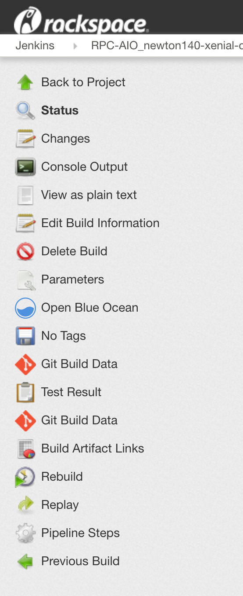
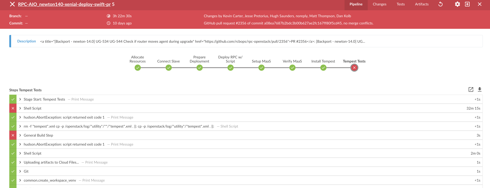
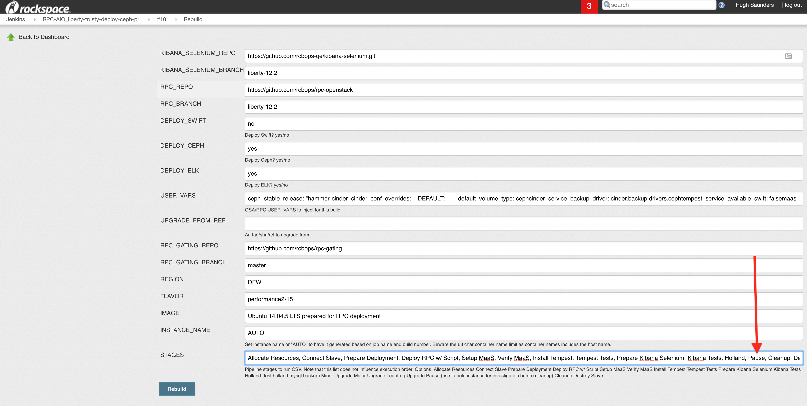
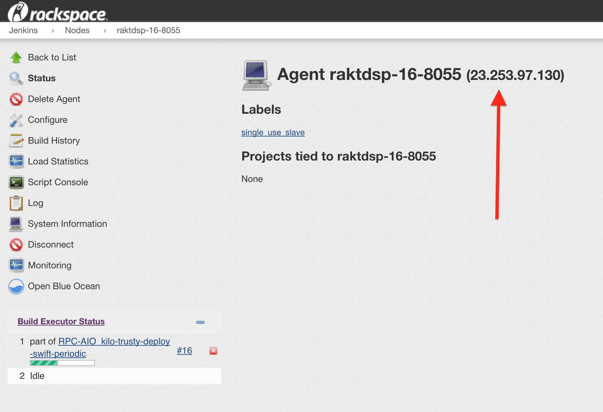

# Debugging Gate Failures

## Blue Ocean
[Blue ocean](https://rpc.jenkins.cit.rackspace.net/blue/organizations/jenkins/pipelines) is the new UI for [Jenkins](https://rpc.jenkins.cit.rackspace.net/), it makes it easier to find the point where
a job failed, without trawling through the console. To use blue ocean, follow
the link from a github pull request status to a job, then click open "Open Blue
Ocean" from the left sidebar.



Blue ocean displays a horizontal pipeline of stages. Stages that failed will
be shown in red. Clicking a stage reveals a list of steps beneath,
steps that failed will also be marked as red. Expanding a step will show it's logs.



Using this method is much quicker for finding the failure point than reading the
console.

## The Console
Jenkins collects all the output of commands it executes, these outputs are
streamed to the console for each Job. This includes logging for Jenkins
operations such as creating a single use instance for a project's jobs to
execute on. As the console includes logging for steps not defined by a project,
its inefficient to wade through it when looking for the cause of a failure.

## Artefacts
While command outputs as viewed in blue ocean or the console are useful, they
don't tell the whole story. Jobs can produce artefacts which are stored
for a [set time](https://github.com/rcbops/rpc-gating/blob/master/playbooks/upload_to_cloud_files.yml#L13-L19) after the completion of a job. For RPC-O AIO builds, these
artefacts include the etc and log dirs of each container and the host.

To view artefacts, click "Build Artifact Links" in the sidebar from the standard
Jenkins UI page for a build. This leads to an artefact index page which usually
contains a single file; a tar of all the available logs and config.

For AIO jobs, the host is the deploy node, so the openstack_deploy directory
which contains all the ansible config can be found in the hosts's etc folder.
That folder also contains all the ansible facts that were cached.

 
## Logging in
If the console and artefacts don't provide enough information, it is possible
to login to a gate instance and investigate the problem. Normally instances
are deleted as soon as they finish executing a job. In order to retain
the instance, the job must be rerun with "Pause" added to the STAGES parameter.

Note that it's not possible to change parameters via a pull request comment
recheck command, so the rerun will have to be triggered from the Jenkins UI. To
trigger a build select 'Rebuild' (not replay!) from the side bar.

Adding Pause will cause Jenkins to wait for input before clearing up the node.
This will not retain the node indefinitely, it will be cleaned up by a periodic
job when it hits the instance [age
limit](https://github.com/rcbops/rpc-gating/blob/master/rpc_jobs/periodic_cleanup.yml#L6-L9).
It's important to continue the paused Jenkins job after you have finished
investigating, as even if the instance is deleted the Job will be reserving at
least one Jenkins executor. To resume a job, view the console for the running job,
the last line will contain links for continue and abort. If you don't have
permissions to resume the job ping us in [slack #rpc-gating ](https://rackspace.slack.com/messages/C0G5K94RJ)

### Obtaining the IP
Search the console for "Stage Complete: Connect Slave" and you should find a
block like:

```
Stage Complete: Connect Slave
[Pipeline] }
[Pipeline] // stage
[Pipeline] node
Running on raltdcp-10-77a6 in /var/lib/jenkins/workspace/RPC-AIO_liberty-trusty-deploy-ceph-pr
```

Note the node name after "running on", view the config for that node:
https://rpc.jenkins.cit.rackspace.net/computer/YOUR-NODE-NAME

The ip is shown in brackets after the node name.


Once you have the ip, ssh to it as root. If your key is not present, see the
next section.

### SSH keys
All the public keys in the [keys file](https://github.com/rcbops/rpc-gating/blob/master/keys/rcb.keys) are injected
into root's authorized keys for all instances used for testing. If you need
access to these instances, create a PR against that file to add your key.


## Contact Us
If you have any issues, please ask the team for help in [slack #rpc-gating](https://rackspace.slack.com/messages/C0G5K94RJ)
